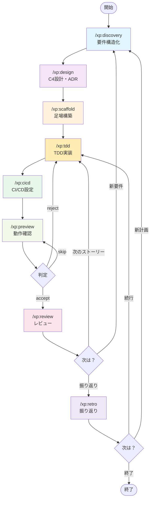
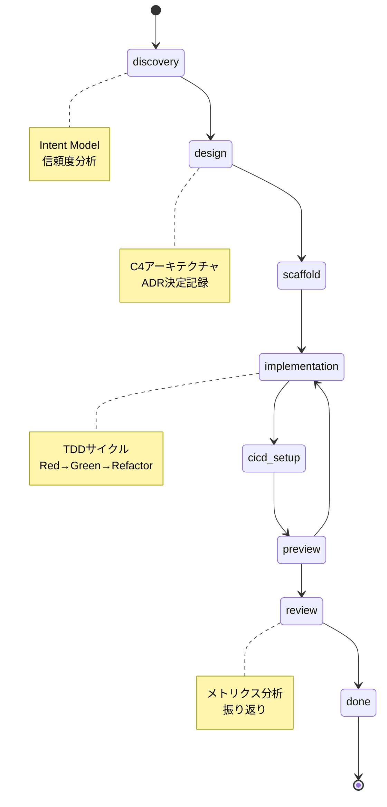
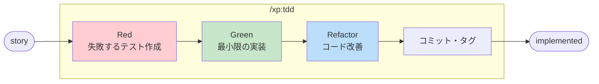
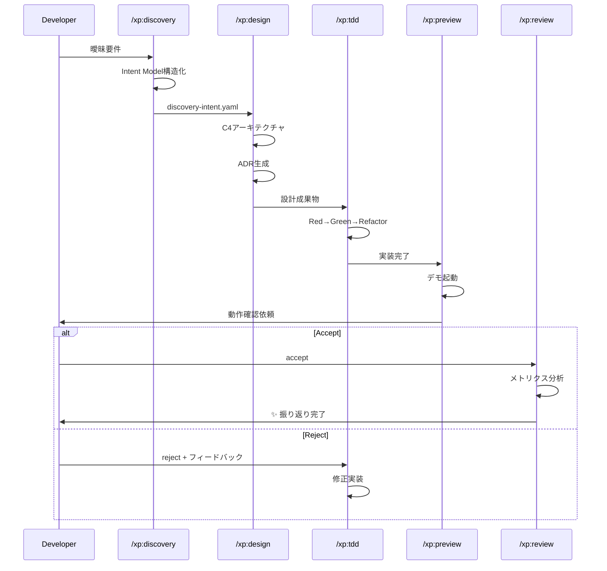
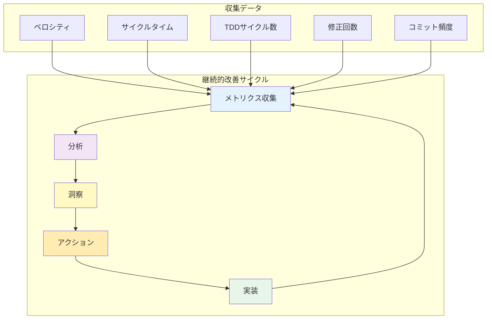

# cc-xp-kit

*🤖 このキットは [Claude Code](https://claude.ai/code) を使った Vibe Coding で開発されました*

Intent Model駆動のXP開発を、9つのスラッシュコマンドで。

## 🎯 哲学

> "シンプルさこそが究極の洗練である" - レオナルド・ダ・ヴィンチ

Intent Modelによる要件構造化からMVP実装まで、XP原則に基づく統合開発プラットフォーム。

- **意図の構造化** - 曖昧要件をIntent Modelで分析・信頼度評価
- **MVP駆動設計** - 確実な価値から段階的拡張
- **サブエージェント** - 専門役割による文脈独立管理
- **TDD実装** - Red→Green→Refactor による厳密サイクル
- **外部統合** - MCP Server経由の拡張性

## 🚀 クイックスタート

### 新規プロジェクトで始める（推奨）

```bash
# 1. 新しいプロジェクトディレクトリを作成
mkdir my-awesome-project
cd my-awesome-project

# 2. cc-xp-kit をプロジェクトにインストール
curl -fsSL https://raw.githubusercontent.com/B16B1RD/cc-xp-kit/main/install.sh | bash -s -- --project

# 3. Claude Code を起動
# Claude Code起動後、以下のコマンドを実行：
/xp:discovery "ウェブブラウザで遊べるテトリスが欲しい"
```

### その他のインストール方法

**既存プロジェクトの場合**：
```bash
cd your-existing-project
curl -fsSL https://raw.githubusercontent.com/B16B1RD/cc-xp-kit/main/install.sh | bash -s -- --project
```

**ユーザー用インストール**（全プロジェクトで共通利用）：
```bash
curl -fsSL https://raw.githubusercontent.com/B16B1RD/cc-xp-kit/main/install.sh | bash -s -- --user
```

## 🔄 9つのXPワークフロー

### ワークフロー全体図



### Intent Model 駆動フロー



### TDDサイクル詳細（/xp:tdd内部）



### Intent Model → MVP フロー



### Intent Model駆動開発サイクル

```bash
# 1. 要件構造化（Intent Model）
/xp:discovery "作りたいもの"

# 2. アーキテクチャ設計
/xp:design

# 3. プロジェクト足場構築
/xp:scaffold

# 4. TDD 実装（Red→Green→Refactor）
/xp:tdd "ユーザーストーリー"

# 5. CI/CD 設定
/xp:cicd

# 6. 動作確認
/xp:preview

# 7. レビュー・振り返り
/xp:review
/xp:retro
```

### 実際の使用例

```bash
# 要件分析から始める
/xp:discovery "ユーザー登録機能を追加したい"

# アーキテクチャ設計
/xp:design

# プロジェクト初期化
/xp:scaffold

# TDDで実装
/xp:tdd "ユーザー登録フォーム"

# CI/CDパイプライン
/xp:cicd

# 動作テスト
/xp:preview

# レビュー・振り返り
/xp:review
/xp:retro
```

## 🛠️ モダンツールチェーン対応

プロジェクトの言語を自動検出し、最適なツールを使用します。

- **JavaScript/TypeScript**: Bun または pnpm + Vite
- **Python**: uv + Ruff + pytest  
- **Rust**: Cargo（標準）
- **Go**: Go modules（標準）
- **Ruby**: mise + Bundler
- **Java**: SDKMAN + Gradle/Maven
- **C#**: .NET CLI（標準）

## 💡 なぜ cc-xp-kit を選ぶのか

### 従来の XP/TDD ツールの問題

- 曖昧要件からの設計飛躍が困難
- 個別ツールの組み合わせの複雑さ
- MVPと将来拡張の適切な分離が困難

### cc-xp-kit の解決策

- **Intent Model 駆動** - 曖昧要件を構造化して信頼度分析
- **サブエージェントアーキテクチャ** - 専門役割による文脈独立管理
- **MVP+Add-ons 設計** - 確実な価値から段階的拡張
- **外部統合対応** - MCP Server経由のシームレス連携

## 📊 典型的な開発セッション

```mermaid
gantt
    title XP開発セッション（2時間）
    dateFormat HH:mm
    axisFormat %H:%M
    
    section 計画
    plan (5分)           :done, plan, 00:00, 5m
    
    section ストーリー1
    story詳細化          :done, story1, after plan, 5m
    develop (TDD)        :done, dev1, after story1, 20m
    review & accept      :done, rev1, after dev1, 5m
    
    section ストーリー2
    story詳細化          :done, story2, after rev1, 5m
    develop (TDD)        :done, dev2, after story2, 15m
    review & reject      :crit, rev2, after dev2, 5m
    develop (修正)       :done, dev2fix, after rev2, 10m
    review & accept      :done, rev2fix, after dev2fix, 5m
    
    section ストーリー3
    story詳細化          :done, story3, after rev2fix, 5m
    develop (TDD)        :done, dev3, after story3, 25m
    review & accept      :done, rev3, after dev3, 5m
    
    section 振り返り
    retro (10分)         :milestone, retro, after rev3, 10m
```



## 🏗️ プロジェクト構造

### cc-xp-kit 構造

```
cc-xp-kit/
├── src/
│   ├── .claude/
│   │   ├── commands/xp/      # 📦 9つのXPコマンド
│   │   │   ├── discovery.md  # 要件構造化
│   │   │   ├── design.md     # アーキテクチャ設計
│   │   │   ├── scaffold.md   # 足場構築
│   │   │   ├── tdd.md        # TDD実装
│   │   │   ├── cicd.md       # CI/CD設定
│   │   │   ├── preview.md    # 動作確認
│   │   │   ├── review.md     # レビュー
│   │   │   ├── retro.md      # 振り返り
│   │   │   └── doc.md        # テンプレート展開
│   │   └── agents/           # サブエージェント
│   └── docs/xp/              # テンプレート・メタデータ
├── install.sh                # インストーラー
└── docs/                     # ドキュメント
```

### ユーザープロジェクト構造

```
your-project/
├── .claude/
│   ├── commands/xp/         # インストールされたコマンド
│   │   ├── discovery.md     # /xp:discovery
│   │   ├── design.md        # /xp:design
│   │   ├── scaffold.md      # /xp:scaffold
│   │   ├── tdd.md           # /xp:tdd
│   │   ├── cicd.md          # /xp:cicd
│   │   ├── preview.md       # /xp:preview
│   │   ├── review.md        # /xp:review
│   │   ├── retro.md         # /xp:retro
│   │   └── doc.md           # /xp:doc
│   └── agents/              # サブエージェント（コピー）
├── docs/xp/                 # プロジェクトデータ（プロジェクト用インストール時に自動コピー）
│   ├── discovery-intent.yaml # Intent Model
│   ├── architecture.md      # C4アーキテクチャ
│   ├── adr/                 # 決定記録
│   ├── templates/           # 各種テンプレート
│   └── metrics.json         # メトリクス
└── .git/                    # Git管理
```

## 🎯 実用的な機能

### バックログ管理

- **YAML 形式** - 人間が読みやすく、Git で追跡可能
- **ストーリーポイント** - Size (1～8) + Value (High/Medium/Low)
- **状態管理** - todo → selected → in-progress → testing → done

### メトリクス追跡

- **ベロシティ** - 完了ストーリーポイント/時間
- **サイクルタイム** - Red→Green→Refactor の所要時間  
- **Git 統計** - コミット数、変更行数による客観的分析

### フィーチャーブランチ戦略

- **ストーリー単位ブランチ** - `story-{id}` での作業分離
- **TDD フェーズコミット** - Red → Green → Refactor の段階的コミット
- **自動マージ・タグ** - 受け入れ時の自動処理

## 📈 メトリクスと改善



## 📜 ライセンス

MIT License - 自由に使ってください。

---

*"勇気とは、恐怖に直面した効果的な行動である" - Kent Beck*

*小さく始めて、継続的にフィードバックを得る。それが XP の本質です。*
