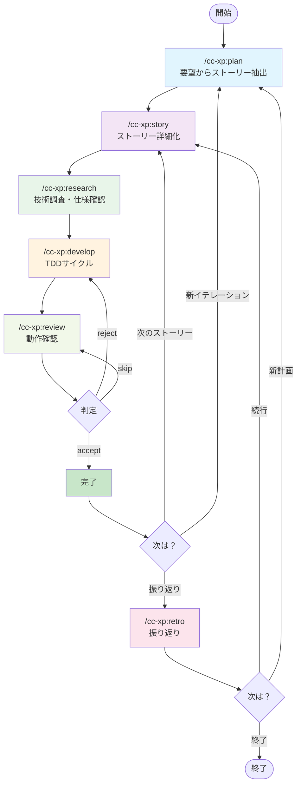
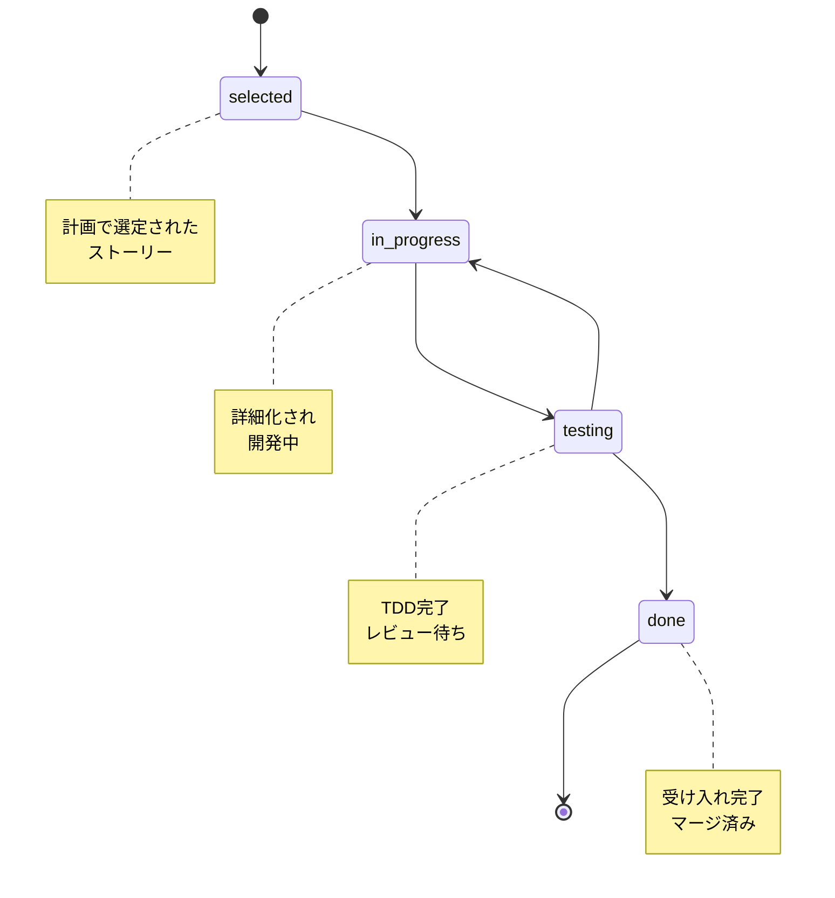
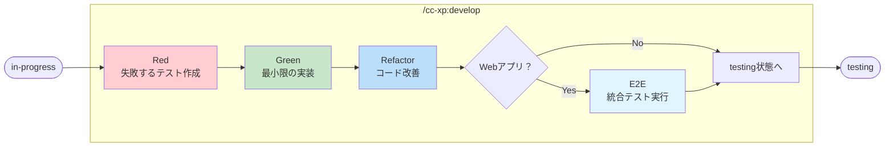
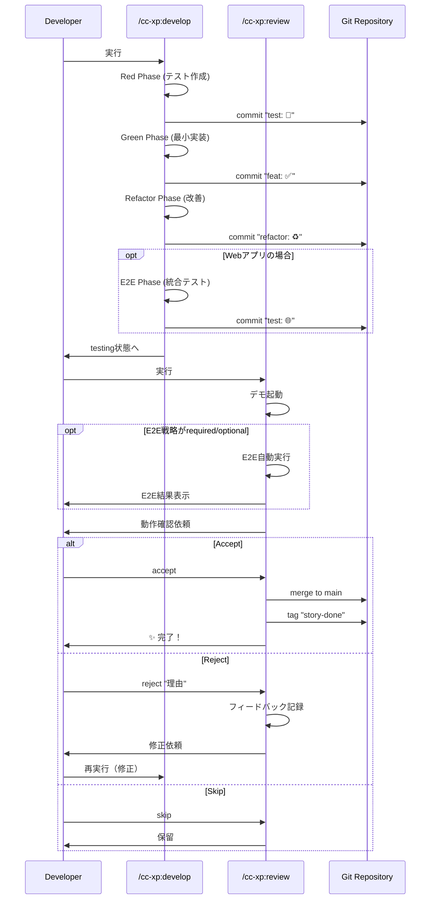
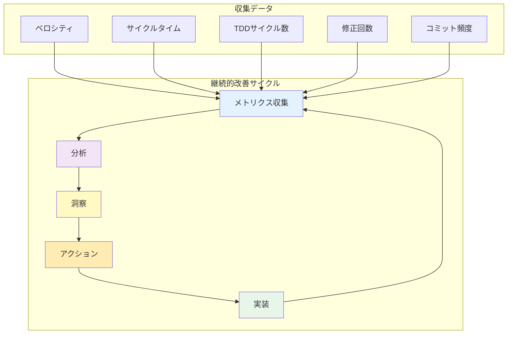

# cc-xp-kit

*🤖 このキットは [Claude Code](https://claude.ai/code) を使った Vibe Coding で開発されました*

Kent Beck XP + TDD 統合開発を、6 つのスラッシュコマンドで。

## 🎯 哲学

> "シンプルさこそが究極の洗練である" - レオナルド・ダ・ヴィンチ

Kent Beck の XP 原則と TDD サイクルを完全統合し、フィーチャーレベルでの実用的開発を実現します。

- **コミュニケーション** - ユーザーストーリー中心の対話型開発
- **シンプルさ** - 6 つのコマンドによる明確なワークフロー
- **フィードバック** - Red→Green→Refactor による継続的改善
- **勇気** - フィーチャーブランチでの安心実験
- **尊重** - モダンツールチェーンと開発者体験の最適化

## 🚀 クイックスタート

### 新規プロジェクトで始める（推奨）

```bash
# 1. 新しいプロジェクトディレクトリを作成
mkdir my-awesome-project
cd my-awesome-project

# 2. cc-xp-kit をプロジェクトにインストール
curl -fsSL https://raw.githubusercontent.com/B16B1RD/cc-xp-kit/main/install.sh | bash -s -- --project

# 3. Claude Code を起動
# Claude Code起動後、以下のコマンドを実行：
/cc-xp:plan "ウェブブラウザで遊べるテトリスが欲しい"
```

### その他のインストール方法

**既存プロジェクトの場合**：
```bash
cd your-existing-project
curl -fsSL https://raw.githubusercontent.com/B16B1RD/cc-xp-kit/main/install.sh | bash -s -- --project
```

**ユーザー用インストール**（全プロジェクトで共通利用）。
```bash
curl -fsSL https://raw.githubusercontent.com/B16B1RD/cc-xp-kit/main/install.sh | bash -s -- --user

## 🔄 6 つの XP ワークフロー（research 必須）+ E2Eテスト統合

### ワークフロー全体図



### ステータス遷移図



### TDD+E2Eサイクル詳細（develop内部）



### develop ↔ review ループ



### 完全統合された開発サイクル

```bash
# 1. 計画立案（YAGNI 原則）
/cc-xp:plan "作りたいもの"

# 2. ユーザーストーリー詳細化
/cc-xp:story

# 3. 技術調査・仕様確認（必須）
/cc-xp:research

# 4. TDD+E2E 実装（Red→Green→Refactor→E2E）
/cc-xp:develop

# 5. 動作確認とフィードバック
/cc-xp:review [accept/reject]

# 6. 振り返りと継続的改善
/cc-xp:retro
```

### 実際の使用例

```bash
# 新機能の計画
/cc-xp:plan "ユーザー登録機能を追加したい"

# ストーリー詳細化
/cc-xp:story

# 技術調査（仕様・ベストプラクティス確認）- 必須ステップ
/cc-xp:research

# TDD 実装
/cc-xp:develop

# 動作確認
/cc-xp:review

# 受け入れまたは修正
/cc-xp:review accept    # または reject "理由"

# 振り返り
/cc-xp:retro
```

## 📊 メトリクス責務表

各コマンドがどのメトリクスをいつ更新するかを明確にします。

| コマンド | バックログ状態更新 | メトリクス更新 | ファイル生成 |
|---------|------------------|--------------|------------|
| **plan** | `selected` ステータスで新規作成 | `metrics.json` 初期化（初回のみ） | `backlog.yaml` |
| **story** | `selected` → `in-progress` | - | `stories/[ID].md` |
| **research** | `research_status` → `completed` | - | `research/[ID]/*.md` (仕様書・実装ガイド等) |
| **develop** | `in-progress` → `testing` | `tddCycles` (red/green/refactor) カウント増加 | テストファイル、実装ファイル |
| **review** | `testing` → `done` (accept時) / `testing` → `in-progress` (reject時) | `completedStories` カウント増加（accept時） | `stories/[ID]-feedback.md` (reject時) |
| **retro** | 変更なし（読み取りのみ） | `iterations` 追加、`velocity` 再計算 | `action-items-[日付].md` |

### メトリクスファイル構造

**`docs/cc-xp/metrics.json`**
```json
{
  "velocity": 0,           // 移動平均で自動計算（retro）
  "completedStories": 0,   // accept時に増加（review）
  "tddCycles": {
    "red": 0,             // Red フェーズ完了時（develop）
    "green": 0,           // Green フェーズ完了時（develop）
    "refactor": 0         // Refactor フェーズ完了時（develop）
  },
  "iterations": []        // イテレーション履歴（retro）
}
```

**`docs/cc-xp/backlog.yaml`**
```yaml
stories:
  - id: [ID]
    status: selected/in-progress/testing/done
    # selected (plan) → in-progress (story) → 
    # testing (develop) → done (review accept のみ)
```

## 🛠️ モダンツールチェーン対応

プロジェクトの言語を自動検出し、最適なツールを使用します。

### ユニットテスト対応

- **JavaScript/TypeScript**: Bun または pnpm + Vite
- **Python**: uv + Ruff + pytest  
- **Rust**: Cargo（標準）
- **Go**: Go modules（標準）
- **Ruby**: mise + Bundler
- **Java**: SDKMAN + Gradle/Maven
- **C#**: .NET CLI（標準）

### E2Eテスト対応（Webアプリケーション）

自動的に E2E テスト環境を検出・実行します。

#### 🎯 MCP Playwright（推奨）

```bash
✅ Claude Code環境で利用可能
• 自動ブラウザ操作
• スクリーンショット取得  
• 要素の自動検出とクリック
• フォーム入力の自動化
```

#### ⚡ 通常Playwright

```bash
npm install playwright
npx playwright install
npx playwright test
```

#### 📋 手動E2Eテスト

Playwright 非対応環境では手動テスト手順を自動生成。

## 💡 なぜ cc-xp-kit を選ぶのか

### 従来の XP/TDD ツールの問題

- 概念的すぎて実装が曖昧
- ツールチェーン統合の複雑さ
- E2E テストの統合不足
- フィーチャーレベルでの実用性不足

### cc-xp-kit の解決策

- **明確な 6 ステップ** - research 必須化で品質向上した開発フロー
- **フィーチャーブランチ統合** - Git ワークフローと完全連携
- **実用的 TDD+E2E** - Red→Green→Refactor→E2E の完全サイクル
- **MCP Playwright統合** - Claude Code 環境での自動 E2E テスト
- **バックログ管理** - YAML 形式でのストーリー追跡

## 📊 典型的な開発セッション

```mermaid
gantt
    title XP開発セッション（2時間）
    dateFormat HH:mm
    axisFormat %H:%M
    
    section 計画
    plan (5分)           :done, plan, 00:00, 5m
    
    section ストーリー1
    story詳細化          :done, story1, after plan, 5m
    develop (TDD)        :done, dev1, after story1, 20m
    review & accept      :done, rev1, after dev1, 5m
    
    section ストーリー2
    story詳細化          :done, story2, after rev1, 5m
    develop (TDD)        :done, dev2, after story2, 15m
    review & reject      :crit, rev2, after dev2, 5m
    develop (修正)       :done, dev2fix, after rev2, 10m
    review & accept      :done, rev2fix, after dev2fix, 5m
    
    section ストーリー3
    story詳細化          :done, story3, after rev2fix, 5m
    develop (TDD)        :done, dev3, after story3, 25m
    review & accept      :done, rev3, after dev3, 5m
    
    section 振り返り
    retro (10分)         :milestone, retro, after rev3, 10m
```



## 🏗️ プロジェクト構造

### cc-xp-kit 構造

```
cc-xp-kit/
├── src/cc-xp/                # 📦 6 つの XP コマンド
│   ├── plan.md              # 計画立案
│   ├── story.md             # ストーリー詳細化
│   ├── research.md          # 技術調査（新規追加）
│   ├── develop.md           # TDD 実装
│   ├── review.md            # 動作確認
│   ├── retro.md             # 振り返り
│   ├── shared/              # 共通コンポーネント（@参照用）
│   │   ├── git-check.md     # Git初期化確認処理
│   │   ├── backlog-reader.md # backlog.yaml読み込み処理
│   │   ├── tdd-principles.md # TDD原則説明
│   │   ├── test-env-check.md # テスト環境確認処理
│   │   ├── next-steps.md    # 次のステップ案内ロジック
│   │   └── xp-principles.md # XP原則説明
│   └── templates/           # 調査記録テンプレート
│       ├── research-specifications.md
│       ├── research-implementation.md
│       ├── research-references.md
│       └── research-decisions.md
├── install.sh                # モダンインストーラー
├── tests/                    # テストスイート
└── docs/                     # ドキュメント
```

### ユーザープロジェクト構造

```
your-project/
├── .claude/commands/        # インストールされたコマンド（プロジェクトローカル）
│   └── cc-xp/
│       ├── plan.md          # /cc-xp:plan
│       ├── story.md         # /cc-xp:story
│       ├── research.md      # /cc-xp:research
│       ├── develop.md       # /cc-xp:develop
│       ├── review.md        # /cc-xp:review
│       ├── retro.md         # /cc-xp:retro
│       ├── shared/          # 共通コンポーネント（@参照用）
│       │   ├── git-check.md
│       │   ├── backlog-reader.md
│       │   ├── tdd-principles.md
│       │   ├── test-env-check.md
│       │   ├── next-steps.md
│       │   └── xp-principles.md
│       └── templates/       # 調査記録テンプレート
│           ├── research-specifications.md
│           ├── research-implementation.md
│           ├── research-references.md
│           └── research-decisions.md
├── docs/cc-xp/              # プロジェクトデータ（自動生成）
│   ├── backlog.yaml         # ストーリーバックログ
│   ├── metrics.json         # ベロシティ・メトリクス
│   ├── stories/             # 詳細化されたストーリー
│   └── research/            # 調査結果（新規追加）
│       └── [story-id]/      # ストーリー別調査記録
│           ├── specifications.md  # 仕様書
│           ├── implementation.md  # 実装ガイド
│           ├── references.md      # 参考資料
│           └── decisions.md       # 技術的決定
└── .git/                    # フィーチャーブランチ管理
```

## 🎯 実用的な機能

### バックログ管理

- **YAML 形式** - 人間が読みやすく、Git で追跡可能
- **ストーリーポイント** - Size (1～8) + Value (High/Medium/Low)
- **状態管理** - todo → selected → in-progress → testing → done

### 技術調査機能（新機能 v0.2.2）

- **公式仕様の確認** - AI の知識に頼らず、最新の公式ドキュメントを調査
- **ベストプラクティス収集** - 実装前に推奨パターンを把握
- **調査結果の記録** - `research/[ID]/*.md` に体系的に保存
- **アンチパターン回避** - 事前に問題を認識して品質向上

### メトリクス追跡

- **ベロシティ** - 完了ストーリーポイント/時間
- **サイクルタイム** - Red→Green→Refactor の所要時間  
- **Git 統計** - コミット数、変更行数による客観的分析

### フィーチャーブランチ戦略

- **ストーリー単位ブランチ** - `story-{id}` での作業分離
- **TDD フェーズコミット** - Red → Green → Refactor の段階的コミット
- **自動マージ・タグ** - 受け入れ時の自動処理

## 📈 メトリクスと改善



## 📜 ライセンス

MIT License - 自由に使ってください。

---

*"勇気とは、恐怖に直面した効果的な行動である" - Kent Beck*

*小さく始めて、継続的にフィードバックを得る。それが XP の本質です。*
