# cc-xp-kit

*🤖 このキットは [Claude Code](https://claude.ai/code) を使った Vibe Coding で開発されました*

Kent Beck XP + TDD 統合開発を、5 つのスラッシュコマンドで。

## 🎯 哲学

> "シンプルさこそが究極の洗練である" - レオナルド・ダ・ヴィンチ

Kent Beck の XP 原則と TDD サイクルを完全統合し、フィーチャーレベルでの実用的開発を実現します。

- **コミュニケーション** - ユーザーストーリー中心の対話型開発
- **シンプルさ** - 5 つのコマンドによる明確なワークフロー
- **フィードバック** - Red→Green→Refactor による継続的改善
- **勇気** - フィーチャーブランチでの安心実験
- **尊重** - モダンツールチェーンと開発者体験の最適化

## 🚀 クイックスタート

### 新規プロジェクトで始める（推奨）

```bash
# 1. 新しいプロジェクトディレクトリを作成
mkdir my-awesome-project
cd my-awesome-project

# 2. cc-xp-kit をプロジェクトにインストール
curl -fsSL https://raw.githubusercontent.com/B16B1RD/cc-xp-kit/main/install.sh | bash -s -- --project

# 3. Claude Code を起動
# Claude Code起動後、以下のコマンドを実行：
/cc-xp:plan "ウェブブラウザで遊べるテトリスが欲しい"
```

### その他のインストール方法

**既存プロジェクトの場合**：
```bash
cd your-existing-project
curl -fsSL https://raw.githubusercontent.com/B16B1RD/cc-xp-kit/main/install.sh | bash -s -- --project
```

**ユーザー用インストール**（全プロジェクトで共通利用）：
```bash
curl -fsSL https://raw.githubusercontent.com/B16B1RD/cc-xp-kit/main/install.sh | bash -s -- --user
```

## 🔄 5 つの XP ワークフロー

### ワークフロー全体図

```mermaid
graph TB
    Start([開始]) --> Plan["/cc-xp:plan<br/>要望からストーリー抽出"]
    Plan --> Story["/cc-xp:story<br/>ストーリー詳細化"]
    Story --> Develop["/cc-xp:develop<br/>TDDサイクル"]
    Develop --> Review["/cc-xp:review<br/>動作確認"]
    
    Review --> ReviewDecision{判定}
    ReviewDecision -->|accept| Done[完了]
    ReviewDecision -->|reject| Develop
    ReviewDecision -->|skip| Review
    
    Done --> NextDecision{次は？}
    NextDecision -->|次のストーリー| Story
    NextDecision -->|振り返り| Retro["/cc-xp:retro<br/>振り返り"]
    NextDecision -->|新イテレーション| Plan
    
    Retro --> NextDecision2{次は？}
    NextDecision2 -->|続行| Story
    NextDecision2 -->|新計画| Plan
    NextDecision2 -->|終了| End([終了])
    
    style Plan fill:#e1f5fe
    style Story fill:#f3e5f5
    style Develop fill:#fff3e0
    style Review fill:#f1f8e9
    style Retro fill:#fce4ec
    style Done fill:#c8e6c9
```



### ステータス遷移図

```mermaid
stateDiagram-v2
    [*] --> selected
    selected --> in_progress
    in_progress --> testing
    testing --> done
    testing --> in_progress
    done --> [*]
    
    note right of selected
        計画で選定された
        ストーリー
    end note
    
    note right of in_progress
        詳細化され
        開発中
    end note
    
    note right of testing
        TDD完了
        レビュー待ち
    end note
    
    note right of done
        受け入れ完了
        マージ済み
    end note
```



### TDDサイクル詳細（develop内部）

```mermaid
graph LR
    subgraph "/cc-xp:develop"
        Red[Red<br/>失敗するテスト作成] --> Green[Green<br/>最小限の実装]
        Green --> Refactor[Refactor<br/>コード改善]
        Refactor --> Commit[testing状態へ]
    end
    
    Start([in-progress]) --> Red
    Commit --> End([testing])
    
    style Red fill:#ffcdd2
    style Green fill:#c8e6c9
    style Refactor fill:#bbdefb
```



### develop ↔ review ループ

```mermaid
sequenceDiagram
    participant Dev as Developer
    participant D as /cc-xp:develop
    participant R as /cc-xp:review
    participant Git as Git Repository
    
    Dev->>D: 実行
    D->>D: Red Phase (テスト作成)
    D->>Git: commit "test: 🔴"
    D->>D: Green Phase (最小実装)
    D->>Git: commit "feat: ✅"
    D->>D: Refactor Phase (改善)
    D->>Git: commit "refactor: ♻️"
    D->>Dev: testing状態へ
    
    Dev->>R: 実行
    R->>R: デモ起動
    R->>Dev: 動作確認依頼
    
    alt Accept
        Dev->>R: accept
        R->>Git: merge to main
        R->>Git: tag "story-done"
        R->>Dev: ✨ 完了！
    else Reject
        Dev->>R: reject "理由"
        R->>R: フィードバック記録
        R->>Dev: 修正依頼
        Dev->>D: 再実行（修正）
    else Skip
        Dev->>R: skip
        R->>Dev: 保留
    end
```



### 完全統合された開発サイクル

```bash
# 1. 計画立案（YAGNI 原則）
/cc-xp:plan "作りたいもの"

# 2. ユーザーストーリー詳細化
/cc-xp:story

# 3. TDD 実装（Red→Green→Refactor）
/cc-xp:develop

# 4. 動作確認とフィードバック
/cc-xp:review [accept/reject]

# 5. 振り返りと継続的改善
/cc-xp:retro
```

### 実際の使用例

```bash
# 新機能の計画
/cc-xp:plan "ユーザー登録機能を追加したい"

# ストーリー詳細化
/cc-xp:story

# TDD 実装
/cc-xp:develop

# 動作確認
/cc-xp:review

# 受け入れまたは修正
/cc-xp:review accept    # または reject "理由"

# 振り返り
/cc-xp:retro
```

## 📊 メトリクス責務表

各コマンドがどのメトリクスをいつ更新するかを明確にします：

| コマンド | バックログ状態更新 | メトリクス更新 | ファイル生成 |
|---------|------------------|--------------|------------|
| **plan** | `selected` ステータスで新規作成 | `metrics.json` 初期化（初回のみ） | `backlog.yaml` |
| **story** | `selected` → `in-progress` | - | `stories/[ID].md` |
| **develop** | `in-progress` → `testing` | `tddCycles` (red/green/refactor) カウント増加 | テストファイル、実装ファイル |
| **review** | `testing` → `done` (accept時)<br/>`testing` → `in-progress` (reject時) | `completedStories` カウント増加（accept時） | `stories/[ID]-feedback.md` (reject時) |
| **retro** | 変更なし（読み取りのみ） | `iterations` 追加、`velocity` 再計算 | `action-items-[日付].md` |

### メトリクスファイル構造

**`docs/cc-xp/metrics.json`**
```json
{
  "velocity": 0,           // 移動平均で自動計算（retro）
  "completedStories": 0,   // accept時に増加（review）
  "tddCycles": {
    "red": 0,             // Red フェーズ完了時（develop）
    "green": 0,           // Green フェーズ完了時（develop）
    "refactor": 0         // Refactor フェーズ完了時（develop）
  },
  "iterations": []        // イテレーション履歴（retro）
}
```

**`docs/cc-xp/backlog.yaml`**
```yaml
stories:
  - id: [ID]
    status: selected/in-progress/testing/done
    # selected (plan) → in-progress (story) → 
    # testing (develop) → done (review accept のみ)
```

## 🛠️ モダンツールチェーン対応

プロジェクトの言語を自動検出し、最適なツールを使用します。

- **JavaScript/TypeScript**: Bun または pnpm + Vite
- **Python**: uv + Ruff + pytest  
- **Rust**: Cargo（標準）
- **Go**: Go modules（標準）
- **Ruby**: mise + Bundler
- **Java**: SDKMAN + Gradle/Maven
- **C#**: .NET CLI（標準）

## 💡 なぜ cc-xp-kit を選ぶのか

### 従来の XP/TDD ツールの問題

- 概念的すぎて実装が曖昧
- ツールチェーン統合の複雑さ
- フィーチャーレベルでの実用性不足

### cc-xp-kit の解決策

- **明確な 5 ステップ** - 迷わない開発フロー
- **フィーチャーブランチ統合** - Git ワークフローと完全連携
- **実用的 TDD** - Red→Green→Refactor の厳密実行
- **バックログ管理** - YAML 形式でのストーリー追跡

## 📊 典型的な開発セッション

```mermaid
gantt
    title XP開発セッション（2時間）
    dateFormat HH:mm
    axisFormat %H:%M
    
    section 計画
    plan (5分)           :done, plan, 00:00, 5m
    
    section ストーリー1
    story詳細化          :done, story1, after plan, 5m
    develop (TDD)        :done, dev1, after story1, 20m
    review & accept      :done, rev1, after dev1, 5m
    
    section ストーリー2
    story詳細化          :done, story2, after rev1, 5m
    develop (TDD)        :done, dev2, after story2, 15m
    review & reject      :crit, rev2, after dev2, 5m
    develop (修正)       :done, dev2fix, after rev2, 10m
    review & accept      :done, rev2fix, after dev2fix, 5m
    
    section ストーリー3
    story詳細化          :done, story3, after rev2fix, 5m
    develop (TDD)        :done, dev3, after story3, 25m
    review & accept      :done, rev3, after dev3, 5m
    
    section 振り返り
    retro (10分)         :milestone, retro, after rev3, 10m
```



## 🏗️ プロジェクト構造

### cc-xp-kit 構造

```
cc-xp-kit/
├── src/cc-xp/                # 📦 5 つの XP コマンド
│   ├── plan.md              # 計画立案
│   ├── story.md             # ストーリー詳細化
│   ├── develop.md           # TDD 実装
│   ├── review.md            # 動作確認
│   └── retro.md             # 振り返り
├── install.sh                # モダンインストーラー
├── tests/                    # テストスイート
└── docs/                     # ドキュメント
```

### ユーザープロジェクト構造

```
your-project/
├── .claude/commands/        # インストールされたコマンド（プロジェクトローカル）
│   └── cc-xp/
│       ├── plan.md          # /cc-xp:plan
│       ├── story.md         # /cc-xp:story
│       ├── develop.md       # /cc-xp:develop
│       ├── review.md        # /cc-xp:review
│       └── retro.md         # /cc-xp:retro
├── docs/cc-xp/              # プロジェクトデータ（自動生成）
│   ├── backlog.yaml         # ストーリーバックログ
│   ├── metrics.json         # ベロシティ・メトリクス
│   └── stories/             # 詳細化されたストーリー
└── .git/                    # フィーチャーブランチ管理
```

## 🎯 実用的な機能

### バックログ管理

- **YAML 形式** - 人間が読みやすく、Git で追跡可能
- **ストーリーポイント** - Size (1～8) + Value (High/Medium/Low)
- **状態管理** - todo → selected → in-progress → testing → done

### メトリクス追跡

- **ベロシティ** - 完了ストーリーポイント/時間
- **サイクルタイム** - Red→Green→Refactor の所要時間  
- **Git 統計** - コミット数、変更行数による客観的分析

### フィーチャーブランチ戦略

- **ストーリー単位ブランチ** - `story-{id}` での作業分離
- **TDD フェーズコミット** - Red → Green → Refactor の段階的コミット
- **自動マージ・タグ** - 受け入れ時の自動処理

## 📈 メトリクスと改善

```mermaid
graph TB
    subgraph "継続的改善サイクル"
        Metrics[メトリクス収集] --> Analysis[分析]
        Analysis --> Insights[洞察]
        Insights --> Actions[アクション]
        Actions --> Implementation[実装]
        Implementation --> Metrics
    end
    
    subgraph "収集データ"
        M1[ベロシティ]
        M2[サイクルタイム]
        M3[TDDサイクル数]
        M4[修正回数]
        M5[コミット頻度]
    end
    
    M1 --> Metrics
    M2 --> Metrics
    M3 --> Metrics
    M4 --> Metrics
    M5 --> Metrics
    
    style Metrics fill:#e3f2fd
    style Analysis fill:#f3e5f5
    style Insights fill:#fff9c4
    style Actions fill:#ffecb3
    style Implementation fill:#e8f5e9
```



## 📜 ライセンス

MIT License - 自由に使ってください。

---

*"勇気とは、恐怖に直面した効果的な行動である" - Kent Beck*

*小さく始めて、継続的にフィードバックを得る。それが XP の本質です。*
